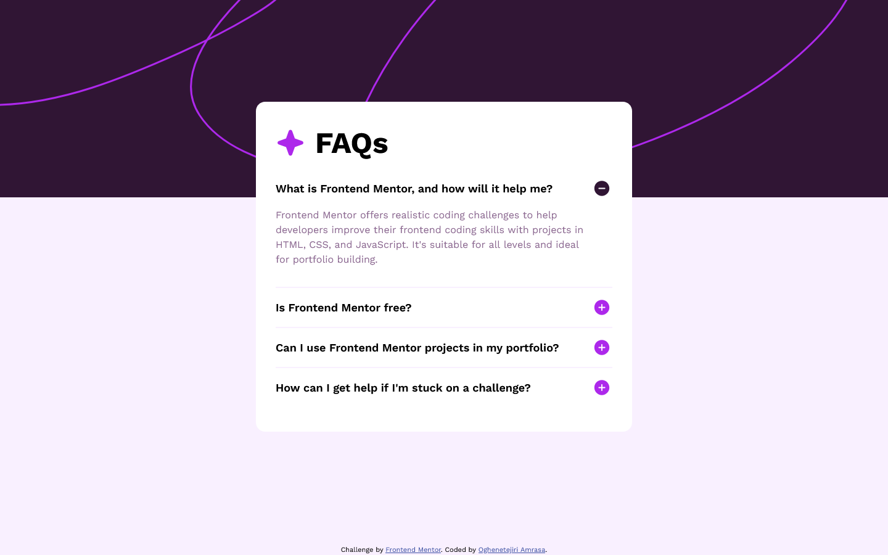
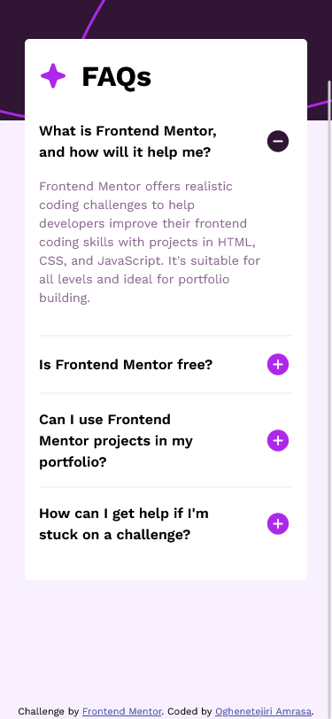

# Frontend Mentor - FAQ accordion solution

This is a solution to the [FAQ accordion challenge on Frontend Mentor](https://www.frontendmentor.io/challenges/faq-accordion-wyfFdeBwBz). Frontend Mentor challenges help you improve your coding skills by building realistic projects.

## Table of contents

- [Overview](#overview)
  - [The challenge](#the-challenge)
  - [Screenshot](#screenshot)
  - [Links](#links)
- [My process](#my-process)
  - [Built with](#built-with)
  - [What I learned](#what-i-learned)
  - [Continued development](#continued-development)
- [Author](#author)

**Note: Delete this note and update the table of contents based on what sections you keep.**

## Overview

### The challenge

Users should be able to:

- Hide/Show the answer to a question when the question is clicked
- Navigate the questions and hide/show answers using keyboard navigation alone
- View the optimal layout for the interface depending on their device's screen size
- See hover and focus states for all interactive elements on the page

### Screenshot




### Links

- Solution URL: [Source code](https://your-solution-url.com)
- Live Site URL: [Deployed site](https://tejiri-faq-challenge.netlify.app/)

## My process

## Build Process Analysis of your FAQ Accordion

The provided code demonstrates a well-structured approach to building an FAQ accordion using HTML, CSS, and JavaScript. Here's a breakdown of the build process:

1. Setting Up the Structure (HTML):

- The HTML starts with a basic document structure including the `<!DOCTYPE html>` declaration, meta tags, and title.
- It imports a Google Font for "Work Sans" and links the external stylesheet (`style.css`).
- The `main` section contains the main content, which is the FAQ accordion.
- Within `main`, the `faq` element represents the accordion container.
- Inside the `faq`, each question is wrapped in an `article` element with the class `question`.
- Each `question` contains a title section (`question__title`) with the question text and a button (`question__btn`) to toggle the answer.
- The answer text is wrapped in a `question__text` element.

2. Styling the Accordion (CSS):

- The CSS starts by defining variables for primary colors used throughout the design.
- It includes a basic CSS reset to ensure consistent styles across browsers.
- The `body` styles define the overall layout, including font family, background color, and a background image.
- Styles are applied progressively for different elements like `h1`, `button`, and `img`.
- The `faq` element defines the width, margin, background color, and border radius for the accordion container.
- Styles are further applied to specific sections within the `question` element, such as the title, button, and answer text.
- Media queries are used to adjust styles for different screen sizes (less than 481px).
- The CSS also includes styles for the footer section.

3. Adding Interactivity (JavaScript):

- The JavaScript uses `document.querySelectorAll` to select all elements with the class `question`.
- It then iterates over each question using a `forEach` loop.
- Inside the loop, it finds the button within the current question using `querySelector`.
- An event listener is added to the button for the "click" event.
- When the button is clicked, another `forEach` loop iterates over all questions again.
- Inside this loop, it checks if the current question is not the one clicked.
  - If it's not the clicked question, it hides the content of the other question using `classList.remove("show-text")`.
- Finally, the clicked question's content is toggled with `classList.toggle("show-text")`. This class likely hides or reveals the answer text based on the CSS properties for that class.

### Built with

- Semantic HTML5 markup
- CSS custom properties
- Flexbox

### What I learned

When setting the width and max width of a container, it is better to to use vw to set the minumum width, that is because vw units ensure that the element's width is always relative to the viewport, providing a more consistent and responsive layout across different screen sizes and if the parent element's width changes dynamically (e.g., due to resizing or media queries), using % units might lead to unexpected changes in the .faq container's width. I spent a little over 50 minutes trying to figure out the problem. It was more apparent whenver I toggled the question text to appear.

This

```css
.faq {
  width: min(85vw, 610px);
}
```

is better than

```css
.faq {
  width: min(85%, 610px);
}
```

### Continued development

I struggled with setting up the css classes to be used with javascript as well so I'll be taking on more DOM projects to improve that.

## Author

- Frontend Mentor - [@Tejiri-A](https://www.frontendmentor.io/profile/Tejiri-A)
